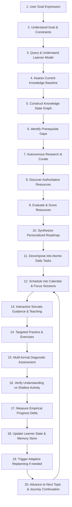

# TARKYAAN — Macro Architecture & System Blueprint
**तर्कयान — Your Autonomous Learning Companion**

---

## 1. Executive Summary & Vision

**Tarkyaan (तर्कयान)** is an AI-powered **Autonomous Learning Companion and Autonomous Learning Planner**. 

Tarkyaan is **not** a generic chatbot. It is not an ungrounded conversational assistant that merely outputs text summaries or static syllabi. Instead, Tarkyaan is a specialized, autonomous educational intelligence that deeply understands a learner, diagnoses their real knowledge state, identifies hidden prerequisites and knowledge gaps, autonomously discovers and evaluates high-yield learning resources, synthesizes dynamic learning plans, breaks them into daily actionable tasks, guides practice, verifies conceptual mastery with evidence, and continuously adapts the trajectory when circumstances change.

### The Philosophical Identity of "Tarkyaan"

The name **Tarkyaan** is rooted in Sanskrit and Hindi:
- **Tark (तर्क)**: Logical reasoning, dialectic enquiry, rational thought, discernment.
- **Yaan (यान)**: Vehicle, carrier, vessel, journey.

Conceptually, **Tarkyaan is "the reasoning-driven vessel that carries the learner forward."** It represents an active journey of intellectual progress, structured by reasoning and sustained by continuous adaptation.

```
                  TARKYAAN
            LEARNING INTELLIGENCE
                     │
                     │  "WHAT to learn & WHY"
                     ▼
             NOVA CAPABILITY LAYER
                     │
                     │  "HOW to execute"
                     ▼
           SAFE VERIFIED EXECUTION
                     │
                     ▼
             LEARNER PROGRESS
```

---

## 2. The Core Separation of Concerns: Tarkyaan vs. NOVA

A foundational design invariant is: **NOVA and Tarkyaan are fundamentally distinct yet seamlessly synergistic layers.**

| Dimension | NOVA Subsystem Foundation | Tarkyaan Learning Intelligence |
| :--- | :--- | :--- |
| **Primary Focus** | System execution, OS integration, multimodal perception, tool execution, safety guards | Cognitive modeling, pedagogical strategy, knowledge state tracking, gap diagnosis, roadmap synthesis |
| **Question Answered** | **"HOW"** do we safely manipulate the system, query the web, run tasks, speak, and capture screen? | **"WHAT"** does the learner need to master next, **"WHY"** do they need it, and **"HOW DEEPLY"** do they understand? |
| **Identity** | Underlying system infrastructure engine | User-facing companion: *"I'm Tarkyaan, your autonomous learning companion."* |
| **State Maintained** | System state, active window, turn queue, audio buffers, disk paths, API latency | Knowledge graph, concept mastery levels (0.0–1.0), misconceptions, study pace, review schedules |
| **Autonomy Scope** | Step-by-step tool dispatch with replanning and timeout recovery | High-level curriculum adaptation, diagnostic probing, practice generation, mastery verification |

### Reusability Tenet
Tarkyaan does **not** rebuild:
- AI provider dispatchers or failover engines (reuses NOVA `ProviderManager`)
- Audio pipelines, VAD, or STT/TTS (reuses NOVA `VoiceManager`, Silero VAD, Faster-Whisper, Edge-TTS)
- Native browser drivers or web scrapers (reuses NOVA `BrowserManager`, `MacOSNativeBrowserEngine`, `WebpageExtractor`)
- Computer vision or mouse/keyboard simulators (reuses NOVA `ComputerAgent`, `NovaEyesManager`, `Apple Vision OCR`)
- Desktop/OS action handlers (reuses NOVA `FileSystemManager`, `AppLauncher`, `MacControlManager`)
- Low-level task execution loop (reuses NOVA `TaskExecutor`, `DynamicReplanner`, `CapabilityRegistry`)
- Concurrency messaging (reuses NOVA `EventBus`)
- Safety sandboxing (reuses NOVA `DesktopSafetyPolicy`, `BrowserSafetyPolicy`)

Tarkyaan **adds the specialized learning mind** atop NOVA's proven multimodal hands, eyes, and voice.

---

## 3. Tarkyaan Macro Architecture

The target runtime architecture connects the user, Tarkyaan's cognitive modules, and NOVA's execution capabilities in a verified loop:

```
                            LEARNER
                               │
                      Voice / Text / UI
                               │
                               ▼
     ┌─────────────────────────────────────────────────────────────┐
     │                TARKYAAN LEARNING INTELLIGENCE               │
     │                                                             │
     │  ┌─────────────────┐ ┌──────────────────┐ ┌──────────────┐  │
     │  │  Learner Model  │ │ Learning Planner │ │  Evaluator   │  │
     │  │  - Profile      │ │ - Goal Analysis  │ │  - Mastery   │  │
     │  │  - Mastery Map  │ │ - Roadmap Engine │ │  - Gaps      │  │
     │  │  - Misconceptions│ │ - Daily Tasks   │ │  - Evidence  │  │
     │  └────────┬────────┘ └────────┬─────────┘ └──────┬───────┘  │
     │           │                   │                  │          │
     │           └───────────────────┼──────────────────┘          │
     │                               ▼                             │
     │                    ADAPTATION CONTROLLER                    │
     │               (Dynamic Curriculum & Replanner)              │
     │                               │                             │
     │                               ▼                             │
     │                 LEARNING STATE / ACTIVE TASKS               │
     └───────────────────────────────┬─────────────────────────────┘
                                     │
                                     ▼
     ┌─────────────────────────────────────────────────────────────┐
     │                    NOVA CAPABILITY LAYER                    │
     │                                                             │
     │  ┌──────────────┐ ┌──────────────┐ ┌─────────────────────┐  │
     │  │ AI Brain     │ │ Browser      │ │ Computer Agent      │  │
     │  │ (Multi-LLM)  │ │ (Chrome/Web) │ │ (Retina OCR/Clicks) │  │
     │  ├──────────────┤ ├──────────────┤ ├─────────────────────┤  │
     │  │ Memory Store │ │ Voice V2     │ │ Filesystem / Desktop│  │
     │  │ (Durable+Vec)│ │ (VAD/Whisper)│ │ (Safe Workspace)    │  │
     │  └──────────────┘ └──────────────┘ └─────────────────────┘  │
     │                               │                             │
     │                               ▼                             │
     │               SAFETY GUARDS & SANDBOX POLICY                │
     │                               │                             │
     │                               ▼                             │
     │                     VERIFIED EXECUTION                      │
     └───────────────────────────────┬─────────────────────────────┘
                                     │
                                     ▼
                           EXECUTION RESULT
                                     │
                                     ▼
                       UPDATE TARKYAAN LEARNER STATE
                                     │
                                     ▼
                    DELIVER FEEDBACK TO LEARNER (TTS/UI)
```

---

## 4. The 20-Stage Autonomous Learning Loop

Tarkyaan operates according to a continuous, evidence-driven learning lifecycle:



1. **User Goal**: Learner expresses objective (e.g., *"Master Dynamic Programming in 3 weeks for placement interviews"*).
2. **Understand Goal**: Decompose objective into target competencies, time horizon, deadline, daily hours.
3. **Understand Learner**: Retrieve background, comfort language (e.g. C++), cognitive style, past session history.
4. **Assess Knowledge**: Generate targeted diagnostic probes rather than assuming complete beginner status.
5. **Model Knowledge State**: Map concepts onto a directed acyclic graph (DAG) with mastery confidence scores.
6. **Identify Knowledge Gaps**: Trace failed concepts backwards to root prerequisite deficits (e.g., recursion call stack confusion).
7. **Research**: Delegate queries to NOVA's `BrowserTaskPlanner` and search APIs without hallucinating URLs.
8. **Discover Resources**: Collect tutorials, problem sets, video timestamps, documentation, and reference repos.
9. **Evaluate Resources**: Score resources by credibility, pedagogical clarity, difficulty alignment, and time efficiency.
10. **Create Personalized Plan**: Build a milestone-driven roadmap customized to the learner's schedule and gaps.
11. **Break into Tasks**: Convert broad milestones into discrete, actionable study tasks (20–45 min chunks).
12. **Schedule**: Allocate tasks to study blocks with spacing and interleaving.
13. **Teach & Guide**: Deliver Socratic explanations, analogies, and mental models via clean audio and formatted UI.
14. **Practice**: Generate targeted coding problems, conceptual questions, or analytical challenges.
15. **Assess**: Evaluate responses across syntax, logic, edge cases, and reasoning depth.
16. **Verify Understanding**: Distinguish genuine application ability from passive consumption (*"Watching a video is not mastery"*).
17. **Measure Progress**: Calculate mastery delta, retention score, and pacing velocity.
18. **Update Model**: Persist updated skill ratings, verified misconceptions, and notes into NOVA `MemoryManager`.
19. **Adapt & Re-plan**: Recalibrate roadmap automatically if learner accelerates, struggles, or changes constraints.
20. **Continue Journey**: Provide consistent continuity across days and weeks (*"Yesterday we struggled with memoization; today let's conquer the tabulation transition"*).

---

## 5. Domain-Agnostic Extensibility

Tarkyaan is engineered to support **any structured learning domain**:
- **Computer Science & Software**: Data Structures & Algorithms, System Design, Full-Stack Development, Compilers, OS internals.
- **Machine Learning & AI**: Mathematical Foundations, Deep Learning Architectures, Reinforcement Learning, Agentic Systems.
- **Academics & Mathematics**: Calculus, Discrete Mathematics, Linear Algebra, Probability, University coursework.
- **Professional & Certifications**: Cloud Architect certifications (AWS/GCP), Security (CISSP), DevOps practices.
- **Standardized Exams & Placements**: Placement technical rounds, GATE, GRE, competitive programming contests.
- **Languages & Humanities**: Structured grammar, conversational fluency, scientific literature review.

The underlying pedagogical engine remains uniform: **Knowledge Graphs + Prerequisite DAGs + Evidence-Based Assessment + Dynamic Replanning.** Only the domain taxonomy and assessment evaluators specialize.

---

## 6. Architectural Subsystems Directory Design

```
tarkyaan/
├── learner/                       # Learner Modeling & Cognitive State
│   ├── learner_model.py          # Unified LearnerProfile and state aggregator
│   ├── knowledge_state.py        # Directed graph of concepts, mastery weights, and decay
│   ├── misconception_engine.py   # Diagnoses and categorizes recurring errors
│   └── learning_history.py       # Session histories, mastery progression timelines
│
├── goals/                         # Goal Analysis & Milestone Specification
│   ├── goal_manager.py           # Ingestion, decomposition, and tracking of learning goals
│   └── goal_state.py             # Active, paused, completed, and archived goal states
│
├── learning/                      # Pedagogical Core & Socratic Teaching
│   ├── gap_analyzer.py           # Prerequisite graph traversal & gap detection
│   ├── learning_strategy.py      # Spacing, interleaving, and cognitive load orchestration
│   ├── teaching.py               # Socratic dialoguer, Feynman technique explainer
│   ├── practice.py               # Exercise generator, challenge builder
│   └── assessment.py             # Multi-tier rubric evaluator (Recall -> Mastery)
│
├── research/                      # Autonomous Educational Research
│   ├── research_engine.py        # Dispatches web research through NOVA browser tools
│   └── resource_evaluator.py     # Scores credibility, clarity, difficulty, and relevance
│
├── planning/                      # Roadmapping, Scheduling, & Replanning
│   ├── learning_planner.py       # Milestone roadmap generator
│   ├── task_manager.py           # Atomic task lifecycle (Pending -> Active -> Verified)
│   ├── scheduler.py              # Time-budget allocation, spaced repetition calendars
│   └── replanner.py              # Dynamic replanning engine reacting to learner evidence
│
├── progress/                      # Telemetry, Velocity, & Adaptation
│   ├── progress_evaluator.py     # Quantifies learning velocity and retention trends
│   └── adaptation_engine.py      # Triggers curriculum adjustments when drift is detected
│
├── memory/                        # NOVA Memory Bridge
│   └── memory_adapter.py         # Adapts Tarkyaan state to NOVA MemoryManager (EDUCATION/GOALS)
│
├── autonomy/                      # Governance & Supervision
│   └── autonomy_controller.py    # Enforces Autonomy Levels 0 through 5 with safety gates
│
├── integration/                   # NOVA Subsystem Adapters
│   ├── nova_capability_bridge.py # Dispatches tasks to NOVA CapabilityRegistry
│   ├── nova_provider_bridge.py   # Routes reasoning & chat through NOVA ProviderManager
│   └── nova_event_bridge.py      # Publishes & subscribes to NOVA EventBus
│
└── ui/                            # Learning Experience Frontend Interfaces
    └── learning_interface.py     # WebSocket & REST payload adapters for learning views
```

---

## 7. Architectural Invariants Preserved from NOVA

1. **Zero Hardcoded Secrets**: All keys, endpoints, and credentials remain governed by `config.settings.Settings` via `SecretStr`.
2. **Local-First & Safety Sandboxed**: Destructive actions (deletions, system changes) require explicit confirmation gates; file writes remain bounded within designated user workspaces (`~/Desktop/NOVA_WORKSPACE`).
3. **Thread Safety & Async Decoupling**: All learning state mutations use re-entrant locks (`threading.RLock`) to guarantee thread safety across voice workers, background schedulers, and UI servers.
4. **Zero-Crash Failover**: LLM interactions route through `ProviderManager` with seamless failover across Gemini, Groq, OpenRouter, and Cerebras.
5. **No Duplicate Execution Engines**: Tarkyaan does not introduce secondary browser drivers, secondary speech audio loops, or secondary keyboard/mouse injectors. NOVA executes; Tarkyaan reasons.
