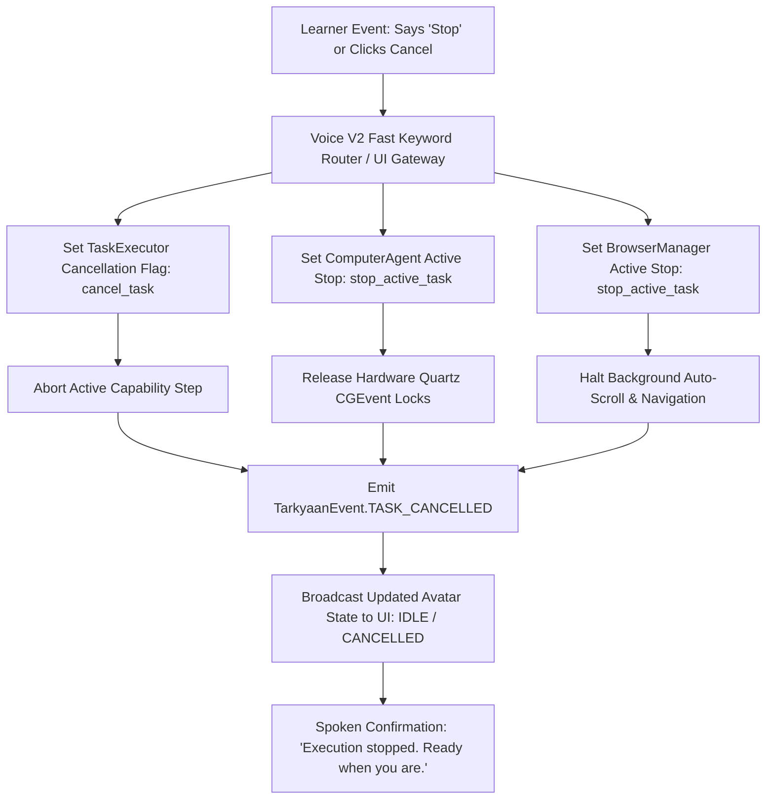

# TARKYAAN — Autonomy Model & Operational Governance
**Multi-Tier Autonomy, Action Boundaries, and Safety Guardrails**

---

## 1. Controlled Autonomy Principles

In Tarkyaan, **autonomy is never unconstrained control**. Real autonomy means taking intelligent, helpful, bounded initiative on behalf of the learner while keeping the human in full control of their environment, data, and learning journey.

### Foundational Tenets
1. **User Invariant Control**: The learner can halt any active action instantly by saying *"Stop"*, *"Cancel"*, or clicking the UI emergency cancel button.
2. **Deterministic Confirmation Gates**: Irreversible actions (file deletion, closing unsaved apps, system shutdown) strictly require two-turn spoken/typed confirmation.
3. **Workspace Confinement**: All file creations and project scaffoldings are restricted to sandboxed directories (`~/Desktop/NOVA_WORKSPACE/Tarkyaan/`). System paths (`/System`, `/usr`, `/Library`, `/etc`) are unconditionally forbidden.
4. **Transparent Intent**: Before initiating multi-step background actions, Tarkyaan states what it is about to do and why.

---

## 2. The 6 Levels of Educational Autonomy

```
LEVEL 5: Adaptive Autonomous Loop (Self-directed diagnostic, research, plan & adapt loop)
   ▲
LEVEL 4: Bounded Autonomous Tasks (Autonomous research, scaffolding, documentation extraction)
   ▲
LEVEL 3: Supervised Task Execution (Plans generated; user confirms each system action)
   ▲
LEVEL 2: Personalized Plan Generation (Syllabus synthesis and task breakdown; no OS actions)
   ▲
LEVEL 1: Contextual Recommendations (Resource suggestions, hints, diagnostic questions)
   ▲
LEVEL 0: Pure Conversational Companion (Answers queries, Socratic dialogue; zero side effects)
```

### Detailed Autonomy Level Specifications

| Level | Name | Permitted Actions | System Access Required | Confirmation Requirement | Cancellation Trigger |
| :---: | :--- | :--- | :--- | :--- | :--- |
| **0** | **Conversational Companion** | Dialogue, answering questions, Socratic hints, conceptual explanations. | AI Provider (`ProviderManager`) only. | None. Pure text/voice interaction. | Immediate on silence or barge-in. |
| **1** | **Contextual Recommender** | Suggesting specific articles, recommending practice problems, reading active window title. | AI Provider, `EnvironmentObserver` (read-only). | None. Recommendations are non-binding suggestions. | User dismisses card in UI. |
| **2** | **Plan & Task Generator** | Synthesizing 30-day study roadmaps, creating daily study schedules, calculating milestone dates. | AI Provider, `MemoryManager` (read/write `EDUCATION`/`GOALS`). | User clicks *"Approve Plan"* in UI before tasks activate. | User rejects generated plan. |
| **3** | **Supervised Execution** | Opening browser tabs, launching VS Code, creating practice files, setting focus timers. | `CapabilityRegistry`, `MacOSNativeBrowserEngine`, `FileSystemManager`. | Explicit per-step or per-session confirmation modal. | User says *"Stop"* or clicks *"Cancel"*. |
| **4** | **Bounded Autonomous Tasks** | Autonomous multi-query web research, downloading approved documentation, scaffolding practice repos, taking screen OCR snapshots of IDE errors. | `BrowserManager`, `NovaEyesManager`, `TaskExecutor`. | Pre-authorized for sandboxed actions within active session. Confirmation required if accessing non-sandboxed files. | Saying *"Stop"*, *"Cancel"*, or pressing ESC key. |
| **5** | **Adaptive Learning Loop** | Continuous end-to-end learning lifecycle: auto-diagnosing gaps, fetching fresh problems, evaluating submitted code, adjusting tomorrow's schedule automatically. | Full NOVA Capability Suite bounded by `DesktopSafetyPolicy` and `BrowserSafetyPolicy`. | Global session activation toggle. Learner can downgrade to Level 2 or 3 at any instant. | Voice barge-in, hotkey cancel, or emergency UI switch. |

---

## 3. Action Boundary & Permissions Matrix

Tarkyaan inherits macOS system privileges through NOVA's unified permissions gateway:

```
macOS Permission Boundaries:
├── Accessibility (AXUIElement)    : Read-only inspection of IDE window titles & UI tree.
├── Screen Recording (Retina Eyes) : In-memory OCR text parsing of error tracebacks.
├── Microphone (Voice V2)          : Continuous listening bounded by local Silero VAD.
├── AppleEvents / Automation       : AppleScript control strictly for Chrome, Safari, Finder.
└── Filesystem (POSIX Permissions) : Confined strictly to ~/Desktop/NOVA_WORKSPACE/Tarkyaan.
```

### Policy Enforcement Matrix

| Action Category | Action Intent | Permitted in Level | Safety Rule Enforced | Verifier Executed |
| :--- | :--- | :--- | :--- | :--- |
| **Browser** | Open tutorial URL | Level 3+ | `BrowserSafetyPolicy`: URL must start with `https://`. Blocks `javascript:`, `data:`, `file:`. | Tab count delta & active URL match. |
| **Browser** | Multi-query research | Level 4+ | Limits page crawl depth to 3; extracts text only; ignores executable downloads. | Valid non-empty `article.summary`. |
| **Filesystem** | Scaffold practice code | Level 3+ | `DesktopSafetyPolicy`: Confined to sandbox root; increments `name_1.cpp` if collision. | `Path.is_file()` and size $> 0$. |
| **Filesystem** | Trash old practice file | Level 3+ | **Mandatory Two-Turn Confirmation**. Uses `safe_move_to_trash` (system trash bin, never `os.remove`). | `not Path.exists()` check. |
| **Computer Agent**| Focus IDE / Type test | Level 4+ | Coordinates verified via Retina scale factor; active window verified before typing. | OCR text delta verification. |
| **System** | Adjust volume for speech | Level 3+ | Bounded to $10\% \le \text{volume} \le 80\%$. | Volume read-back query. |
| **System** | Machine shutdown | Forbidden in Tarkyaan | **Strictly Forbidden** under educational autonomy contexts. | N/A (Denied). |

---

## 4. Emergency Interruption & Cancellation Pipeline

When an autonomous task is running in Level 4 or Level 5, safety requires instantaneous, deterministic termination:



---

## 5. Transparency & User-Facing Observability

Tarkyaan ensures that autonomous execution is always explainable. The UI does not flood the learner with raw technical stack traces. Instead, it displays clear, high-level intent cards:

```
┌────────────────────────────────────────────────────────────────────────┐
│ ✦ TARKYAAN AUTONOMOUS ACTION IN PROGRESS                               │
├────────────────────────────────────────────────────────────────────────┤
│ • Objective    : Scaffolding practice environment for Rotated Array    │
│ • Why          : Diagnosed boundary condition confusion in last quiz   │
│ • Actions Done : Created ~/Desktop/NOVA_WORKSPACE/Tarkyaan/RotatedArray │
│ • Current Step : Opening problem specification in Chrome tab           │
│ • Next Step    : Launching VS Code with starter template               │
│                                                                        │
│ [ Pause ]                              [ Cancel Immediate Execution ]  │
└────────────────────────────────────────────────────────────────────────┘
```
