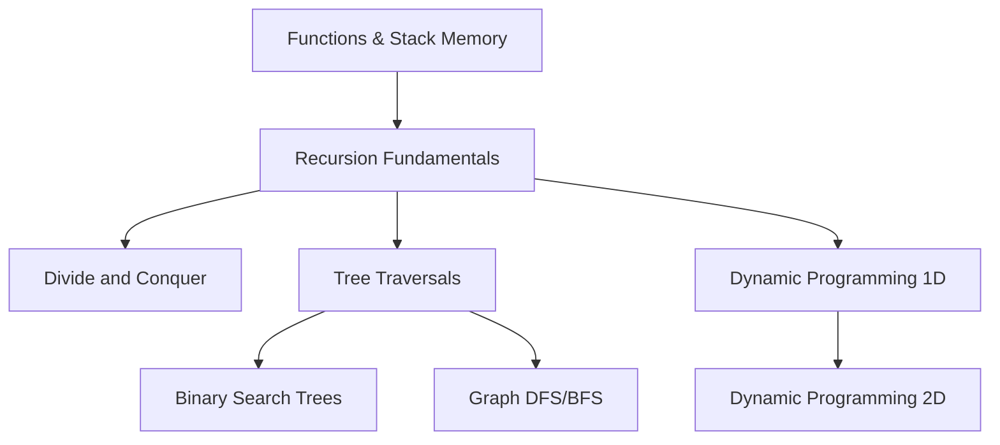

# TARKYAAN — Learner Model & Epistemic State Engine
**The Cognitive Representation of the Human Mind in Tarkyaan**

---

## 1. Executive Conceptual Architecture

Tarkyaan's primary competitive differentiation is **Learner-Centered Intelligence**. Most educational tools treat the user as an anonymous session query. Tarkyaan models the learner as an evolving cognitive graph containing competencies, prerequisite dependencies, active misconceptions, cognitive load limits, and historical trajectories.

```
Learner State Graph
├── Profile (Identity, Academic/Professional Target, Background)
├── Active Goals (Targets, Deadlines, Available Hours/Day)
├── Subjects & Topics (Prerequisite DAG with Multi-domain Support)
├── Knowledge State (Bayesian Mastery Scores: 0.0 to 1.0 per Concept)
├── Knowledge Gaps (Pinpointed Prerequisite Deficits & Blocking Nodes)
├── Misconceptions Taxonomy (Conceptual vs Algorithmic vs Syntax vs Fatigue)
├── Assessment Ledger (Empirical Evidence, Code Submissions, Quiz Answers)
├── Learning History (Session Durations, Retention Curves, Velocity)
├── Cognitive Preferences (Visual vs Text vs Code-first, Preferred IDE/Language)
└── Adaptation Log (Audit Trail of Curriculum Adjustments and Why They Occurred)
```

---

## 2. Formal Component Specifications

### 2.1 Learner Profile & Context
- **`learner_id`**: Unique persistent UUID.
- **`primary_domain`**: Primary focus area (e.g. `Computer Science / DSA`, `Machine Learning`, `Mathematics`).
- **`proficiency_baseline`**: Initial self-reported and diagnostically verified tier (`NOVICE`, `INTERMEDIATE`, `ADVANCED`).
- **`preferred_language`**: Primary implementation language (e.g. `C++`, `Python`, `TypeScript`, `Java`).
- **`daily_time_budget_minutes`**: Realistic daily study window (e.g. `120` minutes).
- **`burnout_risk_indicator`**: Dynamic flag calculated from consecutive high-struggle days or missed sessions.

### 2.2 Knowledge State & Bayesian Mastery Estimation
Knowledge is not binary (know / do not know). Each concept $c$ in the curriculum graph possesses an estimated mastery probability $M(c) \in [0.0, 1.0]$ and an uncertainty factor $U(c) \in [0.0, 1.0]$.

```
Mastery Tier Classification:
• UNEXPLORED    : M(c) == 0.0,  U(c) == 1.0 (No data)
• INTRODUCED    : 0.1 <= M(c) < 0.4 (Basic exposure, cannot apply independently)
• PRACTICING    : 0.4 <= M(c) < 0.7 (Can solve guided problems with occasional errors)
• COMPETENT     : 0.7 <= M(c) < 0.88 (Reliable problem-solving, clean reasoning)
• MASTERED      : 0.88 <= M(c) <= 1.0 (Flawless application, handles edge cases, can teach)
```

#### Mastery Update Algorithm (Bayesian Evidence Integration)
When a learner completes an assessment or exercise on concept $c$:
$$M_{t+1}(c) = M_t(c) + \alpha \cdot (E - M_t(c)) \cdot (1 - U(c))$$
Where:
- $E \in [0.0, 1.0]$ is the empirical performance score on the task.
- $\alpha$ is the learning rate parameter (default $0.25$).
- $U(c)$ decays with each verified piece of evidence ($U_{t+1}(c) = U_t(c) \times 0.75$).

#### Temporal Forgetting & Ebbinghaus Retention Decay
Unpracticed concepts experience predictable exponential decay over elapsed time $\Delta t$ (days):
$$M_{\text{decayed}}(c) = M_{\text{baseline}} + (M(c) - M_{\text{baseline}}) \cdot e^{-\frac{\Delta t}{S_c}}$$
Where $S_c$ is the concept stability factor, increasing each time spaced retrieval succeeds. This drives automated spaced-repetition scheduling.

---

## 3. Prerequisite Graph & Knowledge Gap Analysis

Curricula are represented as a **Directed Acyclic Graph (DAG)** where directed edges $(u \to v)$ denote that concept $u$ is an essential cognitive prerequisite for concept $v$.



### Knowledge Gap Traversal Algorithm
When a learner struggles on concept $V$ (score $E < 0.5$):
1. Evaluate all immediate in-edges $\text{Prerequisites}(V) = \{u_1, u_2, \dots\}$.
2. Query $M(u_i)$ for each prerequisite.
3. If any $M(u_i) < 0.7$, mark $u_i$ as an **Active Blocking Gap**.
4. Recursively traverse parents of $u_i$ to find the **Root Primitive Deficit**.
5. Emit `TarkyaanEvent.KNOWLEDGE_GAP_DETECTED` with the root cause.
6. Trigger the `AdaptationEngine` to inject targeted remedial units before continuing with $V$.

---

## 4. Taxonomy of Misconceptions & Errors

When a learner fails a task, Tarkyaan classifies the failure into one of four distinct categories to provide the correct remedy:

| Misconception Class | Symptom & Evidence | Pedagogical Remedy |
| :--- | :--- | :--- |
| **Conceptual Deficit** | Misunderstands underlying law (e.g. assumes greedy choice works on 0/1 Knapsack). | Step away from code. Use Socratic counter-examples to disprove their assumption. |
| **Algorithmic / Logic Slip** | Understands the concept but makes boundary/off-by-one errors (e.g. `left = mid` causing infinite loop). | Guided dry-run tracing with small manual test inputs. |
| **Syntax / Idiom Friction** | Knows the logic but struggles with language constructs (e.g. C++ iterator invalidation or pointer syntax). | Provide the syntax template directly; do not penalize conceptual mastery. |
| **Cognitive Fatigue / Overload** | Learner was performing well but suddenly begins making trivial errors after 90 minutes. | Recommend a mandatory 15-minute break or wrap the session for the day. |

---

## 5. Cross-Session Continuity & Breadcrumb Persistence

To ensure the learner feels that Tarkyaan genuinely remembers their journey, state is synchronized to NOVA's durable atomic storage (`MemoryManager` under `MemoryCategory.EDUCATION` and `MemoryCategory.GOALS`):

```json
{
  "tarkyaan_session_breadcrumb": {
    "timestamp": "2026-09-12T23:30:00Z",
    "goal_id": "goal_dsa_placement_30d",
    "active_topic": "binary_search_rotated_array",
    "current_mastery": 0.65,
    "last_struggle_point": "handling duplicate elements at pivot boundary",
    "completed_today": ["binary_search_basic", "binary_search_matrix"],
    "recommended_warmup_tomorrow": "Check duplicates in rotated array with left == mid == right",
    "pacing_velocity": "+1.2 topics/day (on schedule)"
  }
}
```

On subsequent startup, Tarkyaan greets the user with precise contextual continuity, immediately dissolving the friction of starting a study session.
