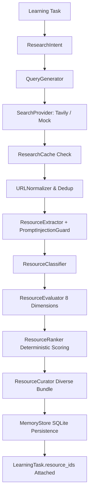

# Tarkyaan (तर्कयान) — Phase 4 Documentation
## Full Capability Foundation + Research Intelligence + Personalized Resource Curation

---

## 1. Phase 4 Objective

Phase 4 establishes the **Full Capability Foundation and Autonomous Research Intelligence** for Tarkyaan (तर्कयान). 

Tarkyaan is not merely a planner, chatbot, or search wrapper; it is an **Autonomous Learning Companion**. To achieve this vision, Tarkyaan requires both deep educational reasoning and a first-class capability foundation comparable to state-of-the-art companion agents (e.g., NOVA), while maintaining strict architectural independence, safety boundaries, and untrusted web defense.

In Phase 4, Tarkyaan achieves:
1. **Unified Provider & Capability Foundation**: A centralized, extensible `CapabilityRegistry` with deterministic permission checks, safety confirmations, and honest self-explanation (`explain_capabilities()`).
2. **Autonomous Research Engine & Resource Intelligence**: An end-to-end research pipeline that takes learning tasks, derives research intents, executes targeted web queries, normalizes and deduplicates URLs, extracts metadata, evaluates quality across 8 pedagogical dimensions, deterministically ranks materials, and curates balanced bundles.
3. **Defense Against Untrusted Web Content**: A robust `PromptInjectionGuard` that sanitizes web snippets and blocks indirect prompt injection or instruction override attacks before search data touches any downstream reasoning logic.
4. **Subsystem Architectures**: Production-ready Category A systems (Research, Capabilities, Events, Permissions, Tasks, Persistence) combined with clean Category B architectural contracts for Voice (ASR/TTS), Browser navigation, Terminal execution, macOS application control, and Desktop environment context observation.

---

## 2. Full NOVA Capability Inventory

Through exhaustive inspection of the read-only NOVA reference project (`NOVA_SETUP`), the following complete capability inventory was mapped:

| NOVA Subsystem | Discovered Capabilities | External Services / Protocols | macOS Permissions |
| :--- | :--- | :--- | :--- |
| **Brain / LLM** | Intent classification, parameter resolution, tool selection, reasoning | Gemini, Groq, Cerebras, OpenRouter | None |
| **Search / Research** | Web search, deep research, article extraction, Q&A synthesis | Tavily Search API, DuckDuckGo | Network |
| **Voice / Speech** | Wake-word detection, continuous speech transcription, neural speech synthesis, cancellation/barge-in | Whisper (local/API), ElevenLabs, EdgeTTS | Microphone, Audio Output |
| **Computer Control / Eyes** | Screen capture, OCR visual analysis, UI element location, mouse click, keystrokes | PyAutoGUI, macOS Screencapture, Vision | Screen Recording, Accessibility |
| **Mac Automation** | App launch/focus, AppleEvents execution, Finder operations, system volume/brightness | AppleScript, `osascript`, NSWorkspace | Automation (AppleEvents) |
| **Terminal Control** | Shell command execution, output streaming, working directory management | `/bin/zsh`, `subprocess` | Terminal / Scoped Disk |
| **Filesystem** | File search, read, write, directory trees, document analysis | Posix OS filesystem | Filesystem Access |
| **External Integrations** | Weather, News, Maps, Google Workspace / Calendar | OpenWeather, NewsAPI, Google Maps, OAuth2 | Network, User OAuth |
| **Safety & Policy** | Confirmation prompts for high-risk actions, command blacklists, execution audit logging | In-memory policy gate | None |
| **Event Bus** | Asynchronous pub/sub event distribution across UI, audio, and tasks | Threaded event dispatch | None |

---

## 3. Capability Parity Matrix

Every discovered capability is categorized under the strict Phase 4 boundaries:
- **A. IMPLEMENT NOW**: Full implementation with unit tests and storage integration.
- **B. ARCHITECTURE / INTERFACE NOW, IMPLEMENT LATER**: Strict typing, abstract contracts, and mock providers established now for Phase 5+.
- **C. NOT APPLICABLE TO TARKYAAN**: Out of scope for an autonomous educational companion.
- **D. BLOCKED BY PLATFORM / PERMISSION**: Dependent on runtime user approval in macOS TCC.

| Capability Area | NOVA Reference | Tarkyaan Ownership | Classification | Status & Implementation Location |
| :--- | :--- | :--- | :--- | :--- |
| **Web Search** | Tavily / DDG | `tarkyaan.research.providers` | **A** | Implemented (Tavily REST + deterministic Mock) |
| **Research Curation** | Ad-hoc summary | `tarkyaan.research.curator` | **A** | Implemented (Primary, Supporting, Practice, Reference) |
| **8-Dim Resource Scoring**| Basic rank | `tarkyaan.research.evaluator` | **A** | Implemented (Relevance, Authority, Quality, Fit, etc.) |
| **Prompt Injection Defense** | Basic regex | `tarkyaan.safety.policies` | **A** | Implemented (`PromptInjectionGuard` active) |
| **Capability Registry** | Tool dictionary | `tarkyaan.capabilities.registry` | **A** | Implemented (15 registered capabilities, honest status) |
| **Event System** | Custom EventBus | `tarkyaan.events.event_bus` | **A** | Implemented (Thread-safe, history buffer, 26 events) |
| **Permission Management** | OS check script | `tarkyaan.safety.permissions` | **A** | Implemented (`PermissionManager`, explicit grant/revoke) |
| **Autonomous Tasks** | Planner/Executor | `tarkyaan.tasks.executor` | **A** | Implemented (Bounded steps, verification, cancellation) |
| **Resource Persistence** | NOVA Memory | `tarkyaan.memory.memory_manager`| **A** | Implemented (Independent SQLite tables & schemas) |
| **Voice Conversation** | Full Voice Loop | `tarkyaan.voice` | **B** | Architecture & interfaces defined (`VoiceManager`) |
| **Browser Automation** | Selenium / CDP | `tarkyaan.browser` | **B** | Architecture & interfaces defined (`BrowserManager`) |
| **Terminal Execution** | Subprocess wrapper | `tarkyaan.terminal` | **B** | Architecture & interfaces defined (`TerminalController`) |
| **Mac App Control** | AppleScript / AppKit | `tarkyaan.mac` | **B** | Architecture & interfaces defined (`MacAppController`) |
| **Screen / Computer Vision** | PyAutoGUI / Screen | `tarkyaan.environment` | **B / D** | Architecture defined; blocked by macOS Screen Recording |
| **Social / Gaming Tools** | Mini-games | N/A | **C** | Not applicable to educational companion |

---

## 4. Implemented Capabilities (Category A)

1. **`research.web_search`**: Autonomous multi-query web search via pluggable providers (Tavily REST API with fallback to offline deterministic Mock provider).
2. **`research.evaluate_resource`**: Objective multi-dimensional pedagogical evaluation across 8 dimensions:
   - Relevance (title/snippet lexical & semantic alignment)
   - Authority (Tier 1 official docs, Tier 2 academic, Tier 3 reputable platforms)
   - Quality (length, clarity, structural markers, commercial ad penalties)
   - Difficulty Fit (calibration against learner's current target tier)
   - Learner Fit (programming language match, learning style alignment)
   - Freshness (technological recency vs timeless algorithmic invariance)
   - Practical Usefulness (presence of code snippets, runnable examples, test cases)
   - Confidence (evaluator certainty metric)
3. **`research.curate_bundle`**: Synthesis of non-redundant, complementary resource bundles:
   - Primary Resource (highest rated conceptual doc or problem)
   - Supporting Resource (interactive visualizer, video, or tutorial)
   - Practice Resource (targeted problem set from LeetCode, Exercism, etc.)
   - Reference Resource (formal standard specification or research paper)
4. **`safety.prompt_injection_guard`**: Content sanitization, control character stripping, and pattern matching against system overrides and malicious web payloads.
5. **`capabilities.registry`**: Self-aware catalog enabling internal reasoning and factual response to *"What can you do?"* without hallucinations.
6. **`events.event_bus`**: Thread-safe publish/subscribe bus with error isolation and historical event replay.
7. **`tasks.executor`**: Autonomous task engine supporting step verification, cancellation events, execution timeouts, and audit logging.
8. **`memory.persistence`**: Complete persistence layer for resources and research history in Tarkyaan's independent SQLite store.

---

## 5. Planned Capabilities (Category B)

1. **Voice Conversation Engine (`tarkyaan.voice`)**:
   - Continuous audio streaming and Voice Activity Detection (VAD).
   - Local Whisper ASR and ElevenLabs / EdgeTTS speech synthesis.
   - Natural conversational interruption (barge-in) and UI audio waveform synchronization.
2. **Controlled Browser Navigation (`tarkyaan.browser`)**:
   - Headless and visual browser sessions for interactive tutorials and coding problem verification.
3. **Safety-Gated Terminal (`tarkyaan.terminal`)**:
   - Controlled execution of sandbox test runs, code builds, and linter checks with strict confirmation policies.
4. **macOS Application Automation (`tarkyaan.mac`)**:
   - AppleEvents automation for Visual Studio Code, Terminal, Finder, and browser tabs.
5. **Environment Observer (`tarkyaan.environment`)**:
   - Periodic workspace context observation (`EYES`) to resolve context like "explain this error in my editor".

---

## 6. Provider Architecture & Configuration

All external service providers adhere to clean abstract contracts defined in `tarkyaan/providers/base.py`:
- `LLMProvider`: Language model reasoning interface.
- `SearchProvider`: Web search and deep query interface.
- `VoiceSTTProvider`: Speech-to-text audio transcription.
- `VoiceTTSProvider`: Text-to-speech audio synthesis.

Providers are managed centrally by `ProviderManager` (`tarkyaan/providers/manager.py`), ensuring that zero provider-specific code is scattered across educational algorithms.

### Environment Configuration (`.env.example`)
Variables discovered from NOVA and integrated into Tarkyaan's configuration:
```bash
# --- AI Provider API Keys ---
GEMINI_API_KEY=
OPENROUTER_API_KEY=
GROQ_API_KEY=
CEREBRAS_API_KEY=

# --- External Search & Web Services ---
TAVILY_API_KEY=
ELEVENLABS_API_KEY=
OPENWEATHER_API_KEY=
NEWSAPI_KEY=
GOOGLE_MAPS_API_KEY=

# --- Google OAuth Credentials (Optional / Planned) ---
GOOGLE_OAUTH_CLIENT_ID=
GOOGLE_OAUTH_CLIENT_SECRET=
GOOGLE_OAUTH_REDIRECT_URI=
```

---

## 7. Research Engine & Resource Intelligence Pipeline



### Deterministic Ranking Equation
$$\text{Composite} = 0.25 \cdot R + 0.20 \cdot L + 0.15 \cdot A + 0.15 \cdot D + 0.10 \cdot Q + 0.10 \cdot P + 0.05 \cdot F$$

Where:
- $R$: Relevance Score
- $L$: Learner Fit Score
- $A$: Authority Score
- $D$: Difficulty Fit Score
- $Q$: Quality Score
- $P$: Practical Usefulness Score
- $F$: Freshness Score

Ties are deterministically resolved by tuple `(overall_score, authority_score, relevance_score, learner_fit_score, resource_id)`.

---

## 8. Safety, Permissions, and Untrusted Data Defense

1. **Untrusted Web Content Isolation**: Web pages and search snippets are treated as strictly untrusted user input. Snippets are sanitized by `PromptInjectionGuard` before processing. Instructions embedded in web pages are never executed.
2. **Destructive Command Confirmation**: Commands like `rm`, `mkfs`, `format`, `dd`, `kill`, or system setting modifications require explicit `ConfirmationRequest` approval.
3. **macOS Security Model**: Permissions for Microphone, Screen Recording, Terminal, and AppleEvents are tracked by `PermissionManager` and never silently bypassed.

---

## 9. Verification & Test Coverage

The entire Tarkyaan test suite consists of **145 deterministic unit and integration tests** passing in ~2.7 seconds with zero live API dependencies:

- **Capability Registry**: Registration, discovery, filtering, and honest reporting (5 tests).
- **Safety & Permissions**: Prompt injection detection, content sanitization, confirmation policies, permission gates (5 tests).
- **Event Bus**: Pub/Sub, global listeners, unsubscribe, history filtering, error resilience (5 tests).
- **Provider Layer**: Registration, default routing, health diagnostics, mock generators (4 tests).
- **Search Providers**: Mock knowledge bank, fallback queries, Tavily REST parsing, HTTP 401/429/timeout handling (8 tests).
- **Research Pipeline**: Task-calibrated queries, URL tracking stripping, candidate deduplication, 8-dimension scoring, deterministic ranking, bundle curation, cache TTL (8 tests).
- **Research Engine**: Task research flow, resource reuse across shared concepts, plan orchestration, failure fallbacks (4 tests).
- **Autonomous Tasks**: Step execution, permission gates, user cancellation, timeout bounds (4 tests).
- **Voice & Subsystems**: Voice state lifecycle, browser manager, terminal controller, Mac app controller, environment observer (5 tests).
- **Regression Suite**: All 97 existing tests from Phase 1 (Learner Model & Memory), Phase 2 (Diagnostics & Misconceptions), and Phase 3 (Planning & Roadmaps) pass with 100% regression stability.
- **Type Checking**: Pyright strict check passes with **0 errors, 0 warnings**.

---

## 10. Future Implementation Roadmap

- **Phase 5 (Next)**: Conversational Voice Companion & Socratic Tutoring Runtime (Whisper ASR + ElevenLabs/EdgeTTS + Dialogue Loop).
- **Phase 6**: Dynamic Replanning, Adaptive Mastery Evaluation, and Cognitive Fatigue Detection.
- **Phase 7**: Controlled Computer Action & Verified Multi-Step Mac Automation.
